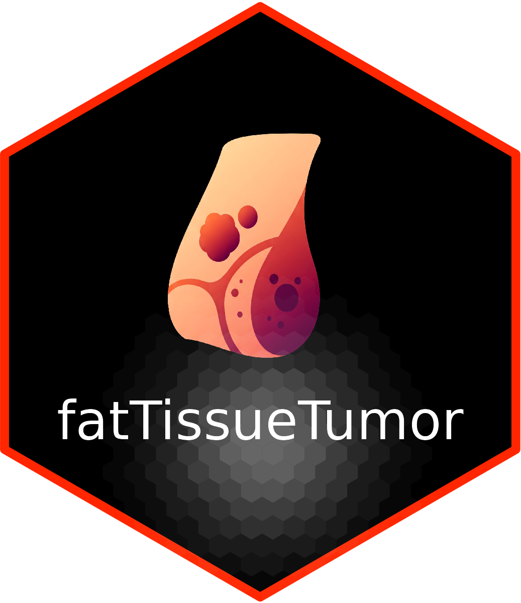

# fatTissueTumor

<!---->

**fatTissueTumor** is an R package for integrated analysis of adipose tissue-tumor interaction, with functions for public data import, advanced preprocessing, co-expression analysis, functional enrichment, and visualization.

<!-- badges: start -->
<!-- badges: end -->


## Installation

You can install the development version of fatTissueTumor like so:

```r
# Da GitHub (se pubblicato)
# remotes::install_github("tuo-utente/fatTissueTumor")

# Da locale
devtools::install()
```

## Main features

Import data from GEO, TCGA, ArrayExpress
Advanced preprocessing pipeline (filters, normalization, batch correction)
Gene co-expression analysis
GO/KEGG/Reactome enrichment analysis
Visualization of results
Thematic sample datasets


## Example

This is a basic example which shows you how to solve a common problem:

``` r
library(fatTissueTumor)

# Load dataset examples
data("expr_breast")
data("pheno_breast")

# Preprocessing
res <- preprocess_expression(expr_breast, log_transform = TRUE, return_report = TRUE)
expr_proc <- res$expr

# Co-expression analysis
top_pairs <- top_gene_coexpression(expr_proc, top_n = 5)
print(top_pairs)

# Enrichment Analysis (required clusterProfiler and org.Hs.eg.db)
if (!requireNamespace("clusterProfiler", quietly = TRUE)) BiocManager::install("clusterProfiler")
if (!requireNamespace("org.Hs.eg.db", quietly = TRUE)) BiocManager::install("org.Hs.eg.db")
library(clusterProfiler)
library(org.Hs.eg.db)
gene_symbols <- rownames(expr_proc)[1:10]
gene_df <- bitr(gene_symbols, fromType = "SYMBOL", toType = "ENTREZID", OrgDb = org.Hs.eg.db)
gene_list <- unique(gene_df$ENTREZID)
ego <- enrichGO(
  gene = gene_list,
  OrgDb = org.Hs.eg.db,
  keyType = "ENTREZID",
  ont = "BP"
)
plot_enrichment_result(ego, type = "dotplot", showCategory = 10)
```

# Load dataset included
expr_breast, pheno_breast (GSE2508, tissue adipose/mammaru)
expr_colon, pheno_colon (GSE44076, colon)
expr_ovary, pheno_ovary (GSE40595, ovary)
expr_coculture, pheno_coculture (E-MTAB-8632, co-colture)

# Vignette and documentation
For a complete and detailed workflow, see the vignette and function documentation (?function_name)

# Licence
This package is distributed under an MIT license.

# Sources
GEO
TCGA
ArrayExpress


<!-- Badge esempio (opzionale, aggiungi se pubblichi su GitHub o CRAN)
[](https://github.com/tuo-utente/fatTissueTumor/actions)
-->

